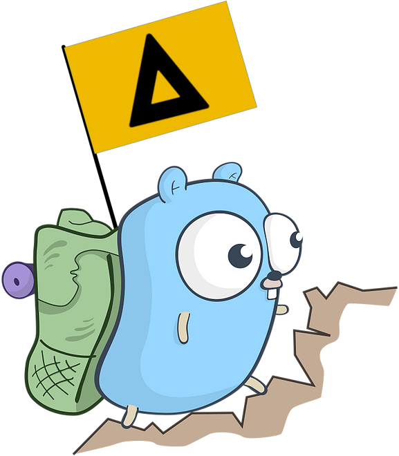

# Go Escale
Biblioteca padrão para projetos Golang da Escale.

<p align="center">
  
</p>

## Como usar
```
go get github.com/escaletech/go-escale
```

## Funcionalidades
[envreader](./docs/envreader.md)

[httpclient](./docs/httpclient.md)

[httpserver](./docs/httpserver.md)

[logger](./docs/logger.md)

[mongodb](./docs/mongodb.md)

[mysqldb](./docs/mysqldb.md)

[requestid](./docs/requestid.md)

[redis](./docs/redis.md)

[slicer](./docs/slicer.md)
